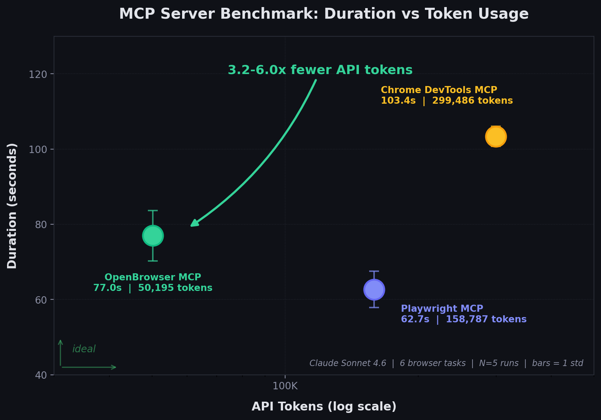

# OpenBrowser

**Automating Walmart Product Scraping:**

https://github.com/user-attachments/assets/ae5d74ce-0ac6-46b0-b02b-ff5518b4b20d


**OpenBrowserAI Automatic Flight Booking:**

https://github.com/user-attachments/assets/632128f6-3d09-497f-9e7d-e29b9cb65e0f


[](https://pypi.org/project/openbrowser-ai/)
[](https://www.python.org/downloads/)
[](https://opensource.org/licenses/MIT)
[](https://github.com/billy-enrizky/openbrowser-ai/actions)

**AI-powered browser automation using CodeAgent and CDP (Chrome DevTools Protocol)**

OpenBrowser is a framework for intelligent browser automation. It combines direct CDP communication with a CodeAgent architecture, where the LLM writes Python code executed in a persistent namespace, to navigate, interact with, and extract information from web pages autonomously.

## Table of Contents

- [Documentation](#documentation)
- [Key Features](#key-features)
- [Installation](#installation)
- [Quick Start](#quick-start)
- [Configuration](#configuration)
- [Supported LLM Providers](#supported-llm-providers)
- [Claude Code Plugin](#claude-code-plugin)
- [Codex](#codex)
- [OpenCode](#opencode)
- [OpenClaw](#openclaw)
- [MCP Server](#mcp-server)
- [MCP Benchmark: Why OpenBrowser](#mcp-benchmark-why-openbrowser)
- [CLI Usage](#cli-usage)
- [Project Structure](#project-structure)
- [Backend and Frontend Deployment](#backend-and-frontend-deployment)
- [Testing](#testing)
- [Contributing](#contributing)
- [License](#license)
- [Contact](#contact)

## Documentation

**Full documentation**: [https://docs.openbrowser.me](https://docs.openbrowser.me)

## Key Features

- **CodeAgent Architecture** - LLM writes Python code in a persistent Jupyter-like namespace for browser automation
- **Raw CDP Communication** - Direct Chrome DevTools Protocol for maximum control and speed
- **Vision Support** - Screenshot analysis for visual understanding of pages
- **12+ LLM Providers** - OpenAI, Anthropic, Google, Groq, AWS Bedrock, Azure OpenAI, Ollama, and more
- **MCP Server** - Model Context Protocol support for Claude Desktop integration
- **Video Recording** - Record browser sessions as video files

## Installation

```bash
pip install openbrowser-ai
```

### With Optional Dependencies

```bash
# Install with all LLM providers
pip install openbrowser-ai[all]

# Install specific providers
pip install openbrowser-ai[anthropic]  # Anthropic Claude
pip install openbrowser-ai[groq]       # Groq
pip install openbrowser-ai[ollama]     # Ollama (local models)
pip install openbrowser-ai[aws]        # AWS Bedrock
pip install openbrowser-ai[azure]      # Azure OpenAI

# Install with video recording support
pip install openbrowser-ai[video]
```

### Install Browser

```bash
uvx openbrowser-ai install
# or
playwright install chromium
```

## Quick Start

### Basic Usage

```python
import asyncio
from openbrowser import CodeAgent, ChatGoogle

async def main():
    agent = CodeAgent(
        task="Go to google.com and search for 'Python tutorials'",
        llm=ChatGoogle(model="gemini-3-flash"),
    )

    result = await agent.run()
    print(f"Result: {result}")

asyncio.run(main())
```

### With Different LLM Providers

```python
from openbrowser import CodeAgent, ChatOpenAI, ChatAnthropic, ChatGoogle

# OpenAI
agent = CodeAgent(task="...", llm=ChatOpenAI(model="gpt-5.2"))

# Anthropic
agent = CodeAgent(task="...", llm=ChatAnthropic(model="claude-sonnet-4-6"))

# Google Gemini
agent = CodeAgent(task="...", llm=ChatGoogle(model="gemini-3-flash"))
```

### Using Browser Session Directly

```python
import asyncio
from openbrowser import BrowserSession, BrowserProfile

async def main():
    profile = BrowserProfile(
        headless=True,
        viewport_width=1920,
        viewport_height=1080,
    )
    
    session = BrowserSession(browser_profile=profile)
    await session.start()
    
    await session.navigate_to("https://example.com")
    screenshot = await session.screenshot()
    
    await session.stop()

asyncio.run(main())
```

## Configuration

### Environment Variables

```bash
# Google (recommended)
export GOOGLE_API_KEY="..."

# OpenAI
export OPENAI_API_KEY="sk-..."

# Anthropic
export ANTHROPIC_API_KEY="sk-ant-..."

# Groq
export GROQ_API_KEY="gsk_..."

# AWS Bedrock
export AWS_ACCESS_KEY_ID="..."
export AWS_SECRET_ACCESS_KEY="..."
export AWS_DEFAULT_REGION="us-west-2"

# Azure OpenAI
export AZURE_OPENAI_API_KEY="..."
export AZURE_OPENAI_ENDPOINT="https://your-resource.openai.azure.com/"
```

### BrowserProfile Options

```python
from openbrowser import BrowserProfile

profile = BrowserProfile(
    headless=True,
    viewport_width=1280,
    viewport_height=720,
    disable_security=False,
    extra_chromium_args=["--disable-gpu"],
    record_video_dir="./recordings",
    proxy={
        "server": "http://proxy.example.com:8080",
        "username": "user",
        "password": "pass",
    },
)
```

## Supported LLM Providers

| Provider | Class | Models |
|----------|-------|--------|
| **Google** | `ChatGoogle` | gemini-3-flash, gemini-3-pro |
| **OpenAI** | `ChatOpenAI` | gpt-5.2, o4-mini, o3 |
| **Anthropic** | `ChatAnthropic` | claude-sonnet-4-6, claude-opus-4-6 |
| **Groq** | `ChatGroq` | llama-4-scout, qwen3-32b |
| **AWS Bedrock** | `ChatAWSBedrock` | anthropic.claude-sonnet-4-6, amazon.nova-pro |
| **AWS Bedrock (Anthropic)** | `ChatAnthropicBedrock` | Claude models via Anthropic Bedrock SDK |
| **Azure OpenAI** | `ChatAzureOpenAI` | Any Azure-deployed model |
| **OpenRouter** | `ChatOpenRouter` | Any model on openrouter.ai |
| **DeepSeek** | `ChatDeepSeek` | deepseek-chat, deepseek-r1 |
| **Cerebras** | `ChatCerebras` | llama-4-scout, qwen-3-235b |
| **Ollama** | `ChatOllama` | llama-4-scout, deepseek-r1 (local) |
| **OCI** | `ChatOCIRaw` | Oracle Cloud GenAI models |
| **Browser-Use** | `ChatBrowserUse` | External LLM service |

## Claude Code Plugin

Install OpenBrowser as a Claude Code plugin:

```bash
# Add the marketplace (one-time)
claude plugin marketplace add billy-enrizky/openbrowser-ai

# Install the plugin
claude plugin install openbrowser@openbrowser-ai
```

This installs the MCP server and 5 built-in skills:

| Skill | Description |
|-------|-------------|
| `web-scraping` | Extract structured data, handle pagination |
| `form-filling` | Fill forms, login flows, multi-step wizards |
| `e2e-testing` | Test web apps by simulating user interactions |
| `page-analysis` | Analyze page content, structure, metadata |
| `accessibility-audit` | Audit pages for WCAG compliance |

See [plugin/README.md](plugin/README.md) for detailed tool parameter documentation.

## Codex

OpenBrowser works with OpenAI Codex via native skill discovery.

### Quick Install

Tell Codex:

```
Fetch and follow instructions from https://raw.githubusercontent.com/billy-enrizky/openbrowser-ai/refs/heads/main/.codex/INSTALL.md
```

### Manual Install

```bash
# Clone the repository
git clone https://github.com/billy-enrizky/openbrowser-ai.git ~/.codex/openbrowser

# Symlink skills for native discovery
mkdir -p ~/.agents/skills
ln -s ~/.codex/openbrowser/plugin/skills ~/.agents/skills/openbrowser

# Restart Codex
```

Then configure the MCP server in your project (see [MCP Server](#mcp-server) below).

Detailed docs: [.codex/INSTALL.md](.codex/INSTALL.md)

## OpenCode

OpenBrowser works with [OpenCode.ai](https://opencode.ai) via plugin and skill symlinks.

### Quick Install

Tell OpenCode:

```
Fetch and follow instructions from https://raw.githubusercontent.com/billy-enrizky/openbrowser-ai/refs/heads/main/.opencode/INSTALL.md
```

### Manual Install

```bash
# Clone the repository
git clone https://github.com/billy-enrizky/openbrowser-ai.git ~/.config/opencode/openbrowser

# Create directories
mkdir -p ~/.config/opencode/plugins ~/.config/opencode/skills

# Symlink plugin and skills
ln -s ~/.config/opencode/openbrowser/.opencode/plugins/openbrowser.js ~/.config/opencode/plugins/openbrowser.js
ln -s ~/.config/opencode/openbrowser/plugin/skills ~/.config/opencode/skills/openbrowser

# Restart OpenCode
```

Then configure the MCP server in your project (see [MCP Server](#mcp-server) below).

Detailed docs: [.opencode/INSTALL.md](.opencode/INSTALL.md)

## OpenClaw

[OpenClaw](https://openclaw.ai) does not natively support MCP servers, but the community
[openclaw-mcp-adapter](https://github.com/androidStern-personal/openclaw-mcp-adapter) plugin
bridges MCP servers to OpenClaw agents.

1. Install the MCP adapter plugin (see its README for setup).

2. Add OpenBrowser as an MCP server in `~/.openclaw/openclaw.json`:

```json
{
  "plugins": {
    "entries": {
      "mcp-adapter": {
        "enabled": true,
        "config": {
          "servers": [
            {
              "name": "openbrowser",
              "transport": "stdio",
              "command": "uvx",
              "args": ["openbrowser-ai[mcp]", "--mcp"]
            }
          ]
        }
      }
    }
  }
}
```

The `execute_code` tool will be registered as a native OpenClaw agent tool.

For OpenClaw plugin documentation, see [docs.openclaw.ai/tools/plugin](https://docs.openclaw.ai/tools/plugin).

## MCP Server

OpenBrowser includes an MCP (Model Context Protocol) server that exposes browser automation as tools for AI assistants like Claude. No external LLM API keys required. The MCP client (Claude) provides the intelligence.

### Quick Setup

**Claude Code**: add to your project's `.mcp.json`:

```json
{
  "mcpServers": {
    "openbrowser": {
      "command": "uvx",
      "args": ["openbrowser-ai[mcp]", "--mcp"]
    }
  }
}
```

**Claude Desktop**: add to `~/Library/Application Support/Claude/claude_desktop_config.json`:

```json
{
  "mcpServers": {
    "openbrowser": {
      "command": "uvx",
      "args": ["openbrowser-ai[mcp]", "--mcp"],
      "env": {
        "OPENBROWSER_HEADLESS": "true"
      }
    }
  }
}
```

**Run directly:**

```bash
uvx openbrowser-ai[mcp] --mcp
```

### Tool

The MCP server exposes a single `execute_code` tool that runs Python code in a persistent namespace with browser automation functions. The LLM writes Python code to navigate, interact, and extract data, returning only what was explicitly requested.

**Available functions** (all async, use `await`):

| Category | Functions |
|----------|-----------|
| **Navigation** | `navigate(url, new_tab)`, `go_back()`, `wait(seconds)` |
| **Interaction** | `click(index)`, `input_text(index, text, clear)`, `scroll(down, pages, index)`, `send_keys(keys)`, `upload_file(index, path)` |
| **Dropdowns** | `select_dropdown(index, text)`, `dropdown_options(index)` |
| **Tabs** | `switch(tab_id)`, `close(tab_id)` |
| **JavaScript** | `evaluate(code)`: run JS in page context, returns Python objects |
| **State** | `browser.get_browser_state_summary()`: get page metadata and interactive elements |
| **CSS** | `get_selector_from_index(index)`: get CSS selector for an element |
| **Completion** | `done(text, success)`: signal task completion |

**Pre-imported libraries**: `json`, `csv`, `re`, `datetime`, `asyncio`, `Path`, `requests`, `numpy`, `pandas`, `matplotlib`, `BeautifulSoup`

### Configuration

| Environment Variable | Description | Default |
|---------------------|-------------|---------|
| `OPENBROWSER_HEADLESS` | Run browser without GUI | `false` |
| `OPENBROWSER_ALLOWED_DOMAINS` | Comma-separated domain whitelist | (none) |

## MCP Benchmark: Why OpenBrowser

### E2E LLM Benchmark (6 Real-World Tasks, N=5 runs)

Six real-world browser tasks run through Claude Sonnet 4.6 on AWS Bedrock (Converse API) with a server-agnostic system prompt. The LLM autonomously decides which tools to call and when the task is complete. 5 runs per server with 10,000-sample bootstrap CIs. All tasks run against live websites.

| # | Task | Description | Target Site |
|:-:|------|-------------|-------------|
| 1 | **fact_lookup** | Navigate to a Wikipedia article and extract specific facts (creator and year) | en.wikipedia.org |
| 2 | **form_fill** | Fill out a multi-field form (text input, radio button, checkbox) and submit | httpbin.org/forms/post |
| 3 | **multi_page_extract** | Extract the titles of the top 5 stories from a dynamic page | news.ycombinator.com |
| 4 | **search_navigate** | Search Wikipedia, click a result, and extract specific information | en.wikipedia.org |
| 5 | **deep_navigation** | Navigate to a GitHub repo and find the latest release version number | github.com |
| 6 | **content_analysis** | Analyze page structure: count headings, links, and paragraphs | example.com |

<p align="center">
  
</p>

| MCP Server | Pass Rate | Duration (mean +/- std) | Tool Calls | Bedrock API Tokens |
|------------|:---------:|------------------------:|-----------:|-------------------:|
| **Playwright MCP** (Microsoft) | 100% | 62.7 +/- 4.8s | 9.4 +/- 0.9 | 158,787 |
| **Chrome DevTools MCP** (Google) | 100% | 103.4 +/- 2.7s | 19.4 +/- 0.5 | 299,486 |
| **OpenBrowser MCP** | 100% | 77.0 +/- 6.7s | 13.8 +/- 2.0 | **50,195** |

OpenBrowser uses **3.2x fewer tokens** than Playwright and **6.0x fewer** than Chrome DevTools, measured via Bedrock Converse API `usage` field (the actual billed tokens including system prompt, tool schemas, conversation history, and tool results).

### Cost per Benchmark Run (6 Tasks)

Based on Bedrock API token usage (input + output tokens at respective rates).

| Model | Playwright MCP | Chrome DevTools MCP | OpenBrowser MCP |
|-------|---------------:|--------------------:|----------------:|
| Claude Sonnet 4.6 ($3/$15 per M) | $0.50 | $0.92 | **$0.18** |
| Claude Opus 4.6 ($5/$25 per M) | $0.83 | $1.53 | **$0.30** |

### Why the Difference

Playwright and Chrome DevTools return full page accessibility snapshots as tool output (~124K-135K tokens for Wikipedia). The LLM reads the entire snapshot to find what it needs. MCP response sizes: Playwright 1,132,173 chars, Chrome DevTools 1,147,244 chars, OpenBrowser 7,853 chars -- a **144x difference**.

OpenBrowser uses a CodeAgent architecture (single `execute_code` tool). The LLM writes Python code that processes browser state server-side and returns only extracted results (~30-1,000 chars per call). The full page content never enters the LLM context window.

```
Playwright: navigate to Wikipedia -> 520,742 chars (full a11y tree returned to LLM)
OpenBrowser: navigate to Wikipedia -> 42 chars (page title only, state processed in code)
             evaluate JS for infobox -> 896 chars (just the extracted data)
```

[Full comparison with methodology](https://docs.openbrowser.me/comparison)

## CLI Usage

```bash
# Run a browser automation task
uvx openbrowser-ai -p "Search for Python tutorials on Google"

# Install browser
uvx openbrowser-ai install

# Run MCP server
uvx openbrowser-ai[mcp] --mcp
```

## Project Structure

```
openbrowser-ai/
├── .claude-plugin/            # Claude Code marketplace config
├── .codex/                    # Codex integration
│   └── INSTALL.md
├── .opencode/                 # OpenCode integration
│   ├── INSTALL.md
│   └── plugins/openbrowser.js
├── plugin/                    # Plugin package (skills + MCP config)
│   ├── .claude-plugin/
│   ├── .mcp.json
│   └── skills/                # 5 browser automation skills
├── src/openbrowser/
│   ├── __init__.py            # Main exports
│   ├── cli.py                 # CLI commands
│   ├── config.py              # Configuration
│   ├── actor/                 # Element interaction
│   ├── agent/                 # LangGraph agent
│   ├── browser/               # CDP browser control
│   ├── code_use/              # Code agent
│   ├── dom/                   # DOM extraction
│   ├── llm/                   # LLM providers
│   ├── mcp/                   # MCP server
│   └── tools/                 # Action registry
├── benchmarks/                # MCP benchmarks and E2E tests
│   ├── playwright_benchmark.py
│   ├── cdp_benchmark.py
│   ├── openbrowser_benchmark.py
│   └── e2e_published_test.py
└── tests/                     # Test suite
```

## Testing

```bash
# Run unit tests
pytest tests/

# Run with verbose output
pytest tests/ -v

# E2E test the MCP server against the published PyPI package
uv run python benchmarks/e2e_published_test.py
```

### Benchmarks

Run individual MCP server benchmarks (JSON-RPC stdio, 5-step Wikipedia workflow):

```bash
uv run python benchmarks/openbrowser_benchmark.py   # OpenBrowser MCP
uv run python benchmarks/playwright_benchmark.py     # Playwright MCP
uv run python benchmarks/cdp_benchmark.py            # Chrome DevTools MCP
```

Results are written to `benchmarks/*_results.json`. See [full comparison](https://docs.openbrowser.me/comparison) for methodology.

## Backend and Frontend Deployment

The project includes a FastAPI backend and a Next.js frontend, both containerized with Docker.

### Prerequisites

- Docker and Docker Compose
- A `.env` file in the project root with `POSTGRES_PASSWORD` and any LLM API keys (see `backend/env.example`)

### Local Development (Docker Compose)

```bash
# Start backend + PostgreSQL (frontend runs locally)
docker-compose -f docker-compose.dev.yml up --build

# In a separate terminal, start the frontend
cd frontend && npm install && npm run dev
```

| Service | URL | Description |
|---------|-----|-------------|
| Backend | http://localhost:8000 | FastAPI + WebSocket + VNC |
| Frontend | http://localhost:3000 | Next.js dev server |
| PostgreSQL | localhost:5432 | Chat persistence |
| VNC | ws://localhost:6080 | Live browser view |

The dev compose mounts `backend/app/` and `src/` as volumes for hot-reload. API keys are loaded from `backend/.env` via `env_file`. The `POSTGRES_PASSWORD` is read from the root `.env` file.

### Full Stack (Docker Compose)

```bash
# Start all services (backend + frontend + PostgreSQL)
docker-compose up --build
```

This builds and runs both the backend and frontend containers together with PostgreSQL.

### Backend

The backend is a FastAPI application in `backend/` with a Dockerfile at `backend/Dockerfile`. It includes:

- REST API on port 8000
- WebSocket endpoint at `/ws` for real-time agent communication
- VNC support (Xvfb + x11vnc + websockify) for live browser viewing on ports 6080-6090
- Kiosk security: Openbox window manager, Chromium enterprise policies, X11 key grabber daemon
- Health check at `/health`

```bash
# Build the backend image
docker build -f backend/Dockerfile -t openbrowser-backend .

# Run standalone
docker run -p 8000:8000 -p 6080:6080 \
  --env-file backend/.env \
  -e VNC_ENABLED=true \
  -e AUTH_ENABLED=false \
  --shm-size=2g \
  openbrowser-backend
```

### Frontend

The frontend is a Next.js application in `frontend/` with a Dockerfile at `frontend/Dockerfile`.

```bash
# Build the frontend image
cd frontend && docker build -t openbrowser-frontend .

# Run standalone
docker run -p 3000:3000 \
  -e NEXT_PUBLIC_API_URL=http://localhost:8000 \
  -e NEXT_PUBLIC_WS_URL=ws://localhost:8000/ws \
  openbrowser-frontend
```

### Environment Variables

Key environment variables for the backend (see `backend/env.example` for the full list):

| Variable | Description | Default |
|----------|-------------|---------|
| `GOOGLE_API_KEY` | Google/Gemini API key | (required) |
| `DEFAULT_LLM_MODEL` | Default model for agents | `gemini-3-flash-preview` |
| `AUTH_ENABLED` | Enable Cognito JWT auth | `false` |
| `VNC_ENABLED` | Enable VNC browser viewing | `true` |
| `DATABASE_URL` | PostgreSQL connection string | (optional) |
| `POSTGRES_PASSWORD` | PostgreSQL password (root `.env`) | (required for compose) |

## Production deployment

AWS production infrastructure (VPC, EC2 backend, API Gateway, Cognito, DynamoDB, ECR, S3 + CloudFront) is defined in Terraform. See **[infra/production/terraform/README.md](infra/production/terraform/README.md)** for architecture, prerequisites, and step-by-step deploy (ECR -> build/push image -> `terraform apply`).

## Contributing

Contributions are welcome! Please:

1. Fork the repository
2. Create a feature branch (`git checkout -b feature/amazing-feature`)
3. Commit your changes (`git commit -m 'Add amazing feature'`)
4. Push to the branch (`git push origin feature/amazing-feature`)
5. Open a Pull Request

## License

This project is licensed under the MIT License - see the [LICENSE](LICENSE) file for details.

## Contact

- **Email**: billy.suharno@gmail.com
- **GitHub**: [@billy-enrizky](https://github.com/billy-enrizky)
- **Repository**: [github.com/billy-enrizky/openbrowser-ai](https://github.com/billy-enrizky/openbrowser-ai)
- **Documentation**: [https://docs.openbrowser.me](https://docs.openbrowser.me)

---

**Made with love for the AI automation community**
