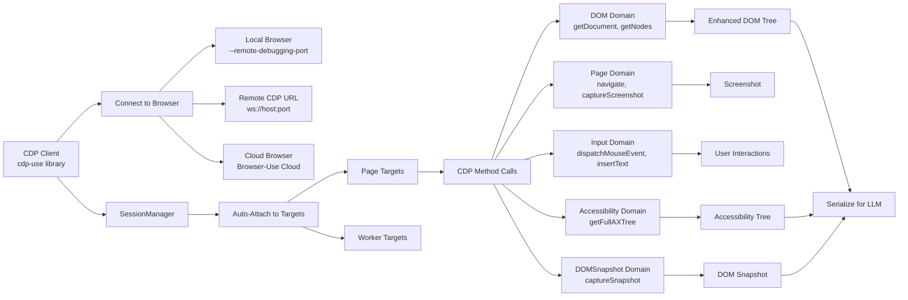
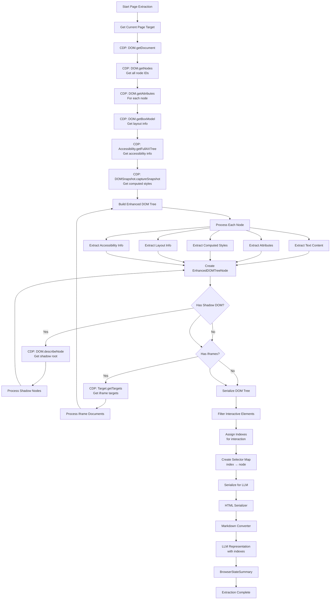
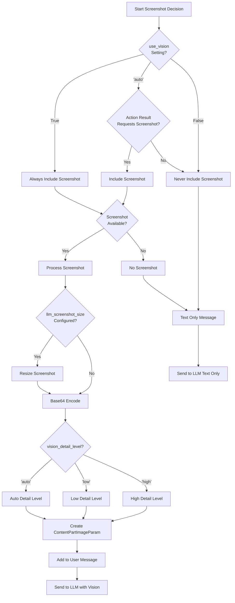
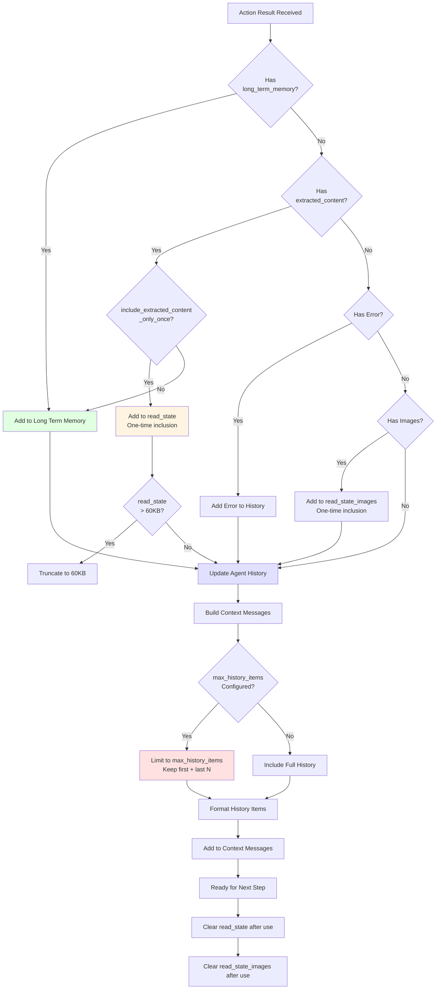
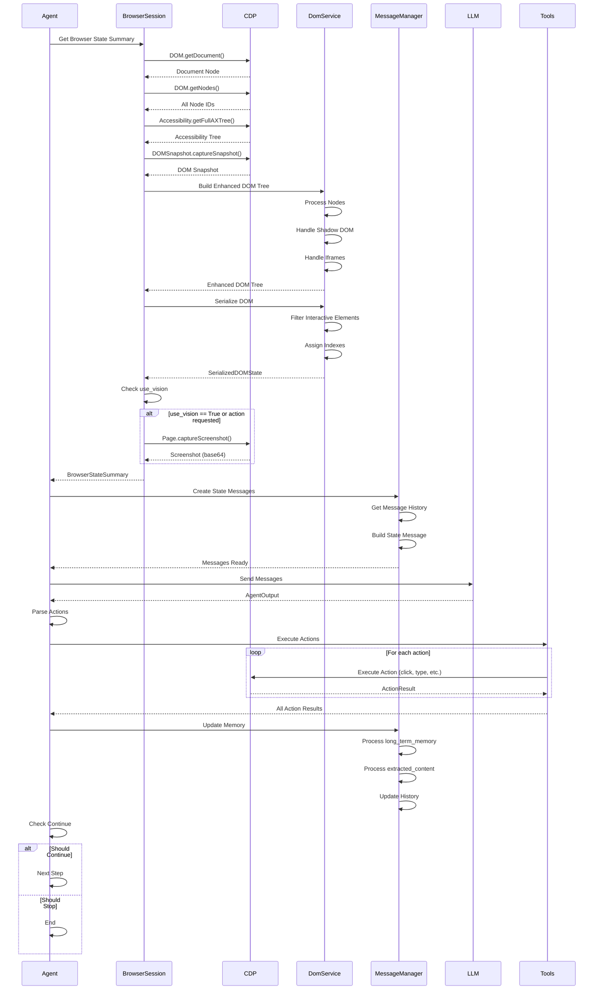

# Browser-Use Agent Process Flow

This document explains the complete process flow of the browser-use agent, including CDP integration, page extraction, screenshot decisions, and memory management.

```mermaid
flowchart TB
    Start([Agent.run starts]) --> Init[Initialize Agent]
    Init --> BrowserInit[Initialize BrowserSession]
    BrowserInit --> CDPConnect{CDP Connection}
    
    CDPConnect -->|Local Browser| StartLocal[Start Chromium Process]
    CDPConnect -->|Remote CDP| ConnectRemote[Connect to CDP URL]
    CDPConnect -->|Cloud Browser| ProvisionCloud[Provision Cloud Browser]
    
    StartLocal --> CDPClient[Create CDP Client]
    ConnectRemote --> CDPClient
    ProvisionCloud --> CDPClient
    
    CDPClient --> SessionMgr[Initialize SessionManager]
    SessionMgr --> AutoAttach[Enable Auto-Attach for Targets]
    AutoAttach --> Watchdogs[Start Watchdog Services]
    
    Watchdogs --> DOMWatchdog[DOMWatchdog<br/>DOM snapshots & screenshots]
    Watchdogs --> PopupsWatchdog[PopupsWatchdog<br/>JavaScript dialogs]
    Watchdogs --> DownloadsWatchdog[DownloadsWatchdog<br/>File downloads]
    Watchdogs --> SecurityWatchdog[SecurityWatchdog<br/>Domain restrictions]
    Watchdogs --> AboutBlankWatchdog[AboutBlankWatchdog<br/>Empty page redirects]
    
    DOMWatchdog --> EventBus[Event Bus<br/>bubus]
    PopupsWatchdog --> EventBus
    DownloadsWatchdog --> EventBus
    SecurityWatchdog --> EventBus
    AboutBlankWatchdog --> EventBus
    
    EventBus --> StepLoop[Step Loop<br/>max_steps iterations]
    
    StepLoop --> PrepareContext[Prepare Context]
    
    PrepareContext --> GetBrowserState[Get Browser State Summary]
    
    GetBrowserState --> CDPGetDOM[CDP: DOM.getDocument]
    CDPGetDOM --> CDPGetNodes[CDP: DOM.getNodes]
    CDPGetNodes --> CDPGetAXTree[CDP: Accessibility.getFullAXTree]
    CDPGetAXTree --> CDPGetSnapshot[CDP: DOMSnapshot.captureSnapshot]
    
    CDPGetSnapshot --> BuildDOMTree[Build Enhanced DOM Tree]
    BuildDOMTree --> SerializeDOM[Serialize DOM for LLM]
    SerializeDOM --> DOMState[SerializedDOMState<br/>with selector_map]
    
    DOMState --> CheckScreenshot{use_vision?}
    
    CheckScreenshot -->|True| AlwaysScreenshot[Always Include Screenshot]
    CheckScreenshot -->|'auto'| CheckActionRequest{Action Requested<br/>Screenshot?}
    CheckScreenshot -->|False| NoScreenshot[No Screenshot]
    
    CheckActionRequest -->|Yes| IncludeScreenshot[Include Screenshot]
    CheckActionRequest -->|No| NoScreenshot
    
    AlwaysScreenshot --> CDPScreenshot[CDP: Page.captureScreenshot]
    IncludeScreenshot --> CDPScreenshot
    CDPScreenshot --> ScreenshotBase64[Base64 Screenshot]
    
    ScreenshotBase64 --> CreateStateMessage[Create State Message]
    NoScreenshot --> CreateStateMessage
    
    CreateStateMessage --> MessageManager[MessageManager]
    
    MessageManager --> GetHistory[Get Message History]
    GetHistory --> SystemMsg[System Message<br/>Task & Instructions]
    SystemMsg --> StateMsg[State Message<br/>DOM + Screenshot]
    StateMsg --> ContextMsg[Context Messages<br/>Previous Steps]
    
    ContextMsg --> BuildMessages[Build LLM Messages]
    BuildMessages --> LLMCall[Call LLM]
    
    LLMCall --> ParseOutput[Parse AgentOutput]
    ParseOutput --> ExtractActions[Extract Actions]
    
    ExtractActions --> ExecuteActions[Execute Actions]
    
    ExecuteActions --> ActionLoop{For each action}
    
    ActionLoop --> GetActionType{Action Type?}
    
    GetActionType -->|click_element| CDPClick[CDP: Input.dispatchMouseEvent]
    GetActionType -->|type| CDPType[CDP: Input.insertText]
    GetActionType -->|scroll| CDPScroll[CDP: Input.dispatchMouseEvent<br/>+ scroll]
    GetActionType -->|navigate| CDPNavigate[CDP: Page.navigate]
    GetActionType -->|screenshot| CDPScreenshotAction[CDP: Page.captureScreenshot]
    GetActionType -->|done| DoneAction[Mark as Done]
    
    CDPClick --> WaitForLoad[Wait for Page Load]
    CDPType --> WaitForLoad
    CDPScroll --> WaitForLoad
    CDPNavigate --> WaitForLoad
    CDPScreenshotAction --> WaitForLoad
    DoneAction --> WaitForLoad
    
    WaitForLoad --> CollectResult[Collect ActionResult]
    CollectResult --> ActionLoop
    
    ActionLoop -->|More actions| GetActionType
    ActionLoop -->|All done| PostProcess[Post Process]
    
    PostProcess --> CheckDownloads[Check for Downloads]
    CheckDownloads --> UpdateFailures[Update Consecutive Failures]
    UpdateFailures --> LogResults[Log Results]
    
    LogResults --> Finalize[Finalize Step]
    
    Finalize --> CreateHistory[Create AgentHistory]
    CreateHistory --> StoreScreenshot[Store Screenshot]
    StoreScreenshot --> EmitEvent[Emit CreateAgentStepEvent]
    EmitEvent --> SaveFileSystem[Save File System State]
    
    SaveFileSystem --> UpdateMemory[Update Memory]
    
    UpdateMemory --> MemoryManager[MessageManager Memory]
    
    MemoryManager --> LongTermMemory{Long Term<br/>Memory?}
    LongTermMemory -->|Yes| AddToHistory[Add to Agent History]
    LongTermMemory -->|No| CheckExtracted{Extracted<br/>Content?}
    
    CheckExtracted -->|include_extracted_content_only_once| ReadState[Add to read_state<br/>One-time use]
    CheckExtracted -->|Regular| AddToHistory
    
    AddToHistory --> UpdateContext[Update Context Messages]
    ReadState --> UpdateContext
    
    UpdateContext --> CheckContinue{Should Continue?}
    
    CheckContinue -->|Stopped| End([End])
    CheckContinue -->|Paused| End
    CheckContinue -->|Done| End
    CheckContinue -->|Max Steps| End
    CheckContinue -->|Max Failures| End
    CheckContinue -->|Continue| StepLoop
    
    style Start fill:#e1f5ff
    style End fill:#ffe1f5
    style CDPClient fill:#fff4e1
    style EventBus fill:#e1ffe1
    style LLMCall fill:#f4e1ff
    style ExecuteActions fill:#ffe1e1
    style MemoryManager fill:#e1e1ff
```

## Detailed Component Explanations

### CDP (Chrome DevTools Protocol) Integration

### Page Extraction Process

### Screenshot Decision Logic

### Memory Management

### Complete Agent Step Flow

## Key Concepts

### 1. CDP Integration
- **Connection Types**: Local browser, Remote CDP URL, or Cloud Browser
- **Session Management**: Auto-attach to all targets (pages, workers)
- **Event-Driven**: Watchdog services monitor browser events via event bus
- **Direct CDP Calls**: DOM, Page, Input, Accessibility, DOMSnapshot domains

### 2. Page Extraction
- **Multi-Step Process**: Get document → Get nodes → Get attributes → Get layout → Get accessibility
- **Enhanced DOM Tree**: Combines DOM, accessibility, and layout information
- **Shadow DOM Support**: Recursively processes shadow roots
- **Iframe Support**: Handles cross-origin iframes
- **Serialization**: Converts to LLM-friendly format with interactive element indexes

### 3. Screenshot Decision
- **use_vision=True**: Always include screenshot
- **use_vision='auto'**: Include only if action requests it
- **use_vision=False**: Never include screenshot
- **Vision Detail Levels**: 'auto', 'low', or 'high' for image processing
- **Screenshot Resizing**: Optional resizing for LLM efficiency

### 4. Memory Management
- **Long Term Memory**: Stored in agent history, persists across steps
- **Read State**: One-time inclusion in next message (for large content)
- **Read State Images**: One-time image inclusion
- **History Limiting**: Optional max_history_items to control context size
- **Error Handling**: Errors added to history for learning

### 5. Agent Execution Flow
- **Step Loop**: Iterates up to max_steps
- **Context Preparation**: Gets browser state, builds messages
- **LLM Interaction**: Sends messages, receives actions
- **Action Execution**: Executes actions via CDP
- **Post Processing**: Updates memory, checks for completion
- **Continuation Logic**: Checks stop conditions (done, max steps, max failures)

