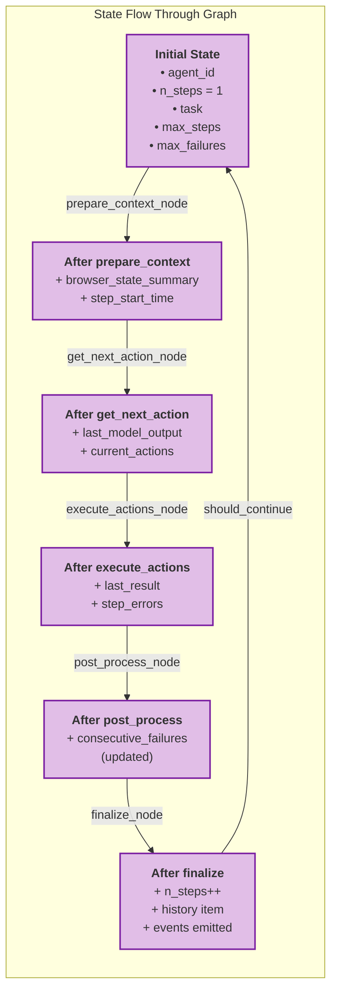

```mermaid
graph LR
    subgraph "State Flow Through Graph"
        S1["`**Initial State**
        • agent_id
        • n_steps = 1
        • task
        • max_steps
        • max_failures`"]
        
        S2["`**After prepare_context**
        + browser_state_summary
        + step_start_time`"]
        
        S3["`**After get_next_action**
        + last_model_output
        + current_actions`"]
        
        S4["`**After execute_actions**
        + last_result
        + step_errors`"]
        
        S5["`**After post_process**
        + consecutive_failures
        (updated)`"]
        
        S6["`**After finalize**
        + n_steps++
        + history item
        + events emitted`"]
        
        S1 -->|prepare_context_node| S2
        S2 -->|get_next_action_node| S3
        S3 -->|execute_actions_node| S4
        S4 -->|post_process_node| S5
        S5 -->|finalize_node| S6
        S6 -->|should_continue| S1
    end
    
    %% Styling
    classDef stateNode fill:#e1bee7,stroke:#7b1fa2,stroke-width:2px
    class S1,S2,S3,S4,S5,S6 stateNode
```
