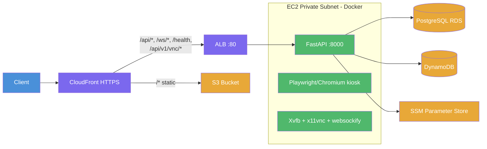
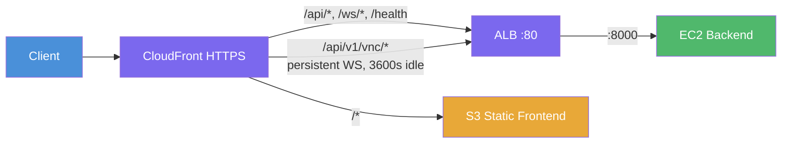

# OpenBrowser-AI Production Infrastructure (Terraform)

This directory defines AWS infrastructure for OpenBrowser-AI: VPC, single EC2 backend (Docker), internet-facing ALB, CloudFront (frontend + API routing), Cognito, PostgreSQL (RDS), DynamoDB, ECR, SSM Parameter Store, and S3 for the static frontend.

## Architecture



- **Frontend**: Static Next.js export on S3, served via CloudFront with Origin Access Control.
- **Backend**: Single EC2 instance (t3.medium, 4 GB RAM + 2 GB swap) in a private subnet running a Docker container with FastAPI, Playwright/Chromium, and a VNC stack (Xvfb, Openbox, x11vnc, websockify).

## File layout

| File | Purpose |
|------|--------|
| `versions.tf` | Terraform/provider requirements, AWS provider, data sources |
| `vpc.tf` | VPC, public/private subnets, NAT, route tables |
| `security_groups.tf` | ALB, backend EC2, and PostgreSQL security groups |
| `alb.tf` | Internet-facing ALB, target group, HTTP listener (idle timeout 3600s) |
| `backend.tf` | EC2 instance, user_data, target group attachment |
| `rds.tf` | PostgreSQL RDS instance and subnet group |
| `iam.tf` | Backend EC2 IAM role: ECR, DynamoDB, Secrets, SSM permissions |
| `ecr.tf` | ECR repository and lifecycle policy for backend image |
| `dynamodb.tf` | Sessions table + VPC endpoint |
| `secrets.tf` | Optional Secrets Manager secret for LLM keys |
| `cognito.tf` | User pool, app client, hosted domain |
| `frontend.tf` | S3 bucket, CloudFront distribution, OAC, CloudFront Function |
| `main.tf` | SSM parameters for API keys (Google, OpenAI, Anthropic) |
| `outputs.tf` | URLs and IDs (API, frontend, Cognito, ECR, etc.) |
| `variables.tf` | Input variables |
| `REQUEST_FLOW.md` | Detailed request flow and architecture |
| `AUTHENTICATION.md` | Cognito JWT setup and frontend integration |
| `COGNITO_SETUP.md` | Callback URL behavior for Cognito SPA PKCE |

## Prerequisites

- [Terraform](https://www.terraform.io/downloads) >= 1.5
- AWS CLI configured with credentials for the target account/region
- Docker (for building and pushing the backend image to ECR)

## Quick start

1. **Copy and edit variables**

   ```bash
   cd infra/production/terraform
   cp terraform.tfvars.example terraform.tfvars
   # Edit terraform.tfvars (aws_region, project_name, instance type, etc.)
   ```

2. **Create ECR and push backend image**

   ```bash
   terraform init
   terraform apply -target=aws_ecr_repository.backend
   REPO=$(terraform output -raw backend_ecr_repository_url)
   REGION=$(terraform output -raw aws_region)
   aws ecr get-login-password --region $REGION | docker login --username AWS --password-stdin ${REPO%%/*}
   # From repo root:
   docker build --platform linux/amd64 -t openbrowser-backend -f backend/Dockerfile .
   docker tag openbrowser-backend:latest $REPO:latest
   docker push $REPO:latest
   ```

3. **Apply full infrastructure**

   ```bash
   terraform plan
   terraform apply
   ```

4. **Push API keys to SSM Parameter Store**

   ```bash
   # From project root:
   bash infra/production/scripts/push_api_keys.sh
   ```

5. **Verify**

   ```bash
   curl -s "https://$(terraform output -raw frontend_url | sed 's|https://||')/health"
   ```

## Deploy scripts

All deploy scripts live in `infra/production/scripts/` and read infrastructure values from `terraform output` (zero hardcoded values):

| Script | Purpose |
|--------|---------|
| `push_api_keys.sh` | Read `.env`, push GOOGLE/OPENAI/ANTHROPIC keys to SSM Parameter Store |
| `deploy-backend.sh` | Build Docker (linux/amd64), push ECR, hot-deploy EC2 via SSM, verify health |
| `deploy-frontend.sh` | Wrapper around `build_frontend_from_tf.sh --deploy` |
| `build_frontend_from_tf.sh` | Read TF outputs, write `.env.production.local`, `npm run build`, S3 sync + CloudFront invalidate |

```bash
# Full deployment from project root:
bash infra/production/scripts/push_api_keys.sh
bash infra/production/scripts/deploy-backend.sh
bash infra/production/scripts/deploy-frontend.sh
```

## What's included

| Component | Purpose |
|-----------|--------|
| **VPC** | Public/private subnets (2 AZs), NAT, DynamoDB VPC endpoint |
| **EC2 backend** | t3.medium in private subnet; Docker container from ECR with FastAPI + Playwright + VNC |
| **PostgreSQL (RDS)** | db.t4g.micro, v16.4; chat/conversation persistence |
| **ALB** | Internet-facing, 3600s idle timeout (persistent VNC WebSocket), health check `/health` |
| **CloudFront** | Primary entry point; routes API to ALB, static to S3; CloudFront Function for SPA URI rewrite |
| **Cognito** | User pool, app client, hosted domain for PKCE auth |
| **DynamoDB** | Table `{project_name}-sessions`; VPC endpoint for private access |
| **ECR** | Backend image repo; EC2 pulls from here on deploy |
| **SSM Parameter Store** | API keys (Google, OpenAI, Anthropic); EC2 reads at container start |
| **S3** | Static frontend bucket; private, CloudFront OAC access only |

## Variables

See `variables.tf`. Key ones:

- **backend_instance_type** -- EC2 instance type (default `t3.medium`).
- **backend_image** -- Leave `""` to use the ECR repo Terraform creates; set to a full URI to use another registry.
- **backend_image_tag** -- Tag to pull from the Terraform ECR repo (default `latest`).
- **backend_port** -- Port the backend listens on (default `8000`).
- **postgres_db_name** / **postgres_username** / **postgres_instance_class** -- PostgreSQL settings.
- **enable_backend_auth** -- Set `true` to require Cognito JWT in FastAPI (REST + WebSocket).
- **cognito_callback_urls** / **cognito_logout_urls** -- Optional explicit OAuth URLs. If empty, Terraform auto-generates from frontend domain + localhost.
- **frontend_domain_name** / **frontend_acm_certificate_arn** -- Optional custom domain for CloudFront.

## Traffic flow



## Auth (Cognito + Hosted UI + PKCE)

- **AUTHENTICATION.md** -- Env values and deploy steps for frontend PKCE implementation.
- **COGNITO_SETUP.md** -- Callback/logout URL behavior and when to override Terraform defaults.

Auth is enforced in the backend (`enable_backend_auth = true`).

CORS origins are auto-derived from the CloudFront domain (no manual configuration needed).

## Frontend deploy

Use the deploy script:

```bash
bash infra/production/scripts/deploy-frontend.sh
```

Or manually:

```bash
bash infra/production/scripts/build_frontend_from_tf.sh --deploy
```

The script reads all Terraform outputs, writes `.env.production.local`, builds with `npm run build`, syncs to S3 with proper cache headers (immutable for hashed assets, no-cache for HTML), and invalidates CloudFront.

## Outputs

| Output | Purpose |
|--------|---------|
| `frontend_url` | CloudFront URL (primary entry point) |
| `frontend_s3_bucket` | Deploy static files here |
| `cloudfront_distribution_id` | For cache invalidation |
| `backend_ecr_repository_url` | Where to push the Docker image |
| `backend_image_uri` | What EC2 pulls |
| `backend_instance_id` | EC2 instance for SSM deploy commands |
| `cognito_user_pool_id` / `cognito_app_client_id` / `cognito_domain_url` | Auth config |
| `postgres_endpoint` / `postgres_port` / `postgres_db_name` / `postgres_password` | DB config |
| `ssm_google_api_key_name` / `ssm_openai_api_key_name` / `ssm_anthropic_api_key_name` | SSM key names |
| `aws_region` | Deployment region |

## Troubleshooting

- **Health check fails** -- Ensure backend serves `GET /health` with 200. Check via SSM: `docker logs openbrowser-backend --tail 50`.
- **504 Gateway Timeout** -- EC2 OOM. Check `free -m` via SSM. Ensure swap exists (2 GB in `/etc/fstab`).
- **VNC WebSocket disconnects** -- ALB idle timeout is 3600s. If connection drops, check CloudFront -> ALB path.
- **SSM command "Delayed"** -- EC2 is unresponsive (OOM or disk full). Reboot: `aws ec2 reboot-instances --region ca-central-1 --instance-ids <id>`.
- **EC2 not pulling image** -- Confirm image exists in ECR and IAM role has ECR read.
- **SCP blocks ec2:Describe** -- University AWS account restricts some APIs. Use SSM or Terraform state as workarounds.

## Cleanup

```bash
terraform destroy
```

Removes all resources created by this configuration.
