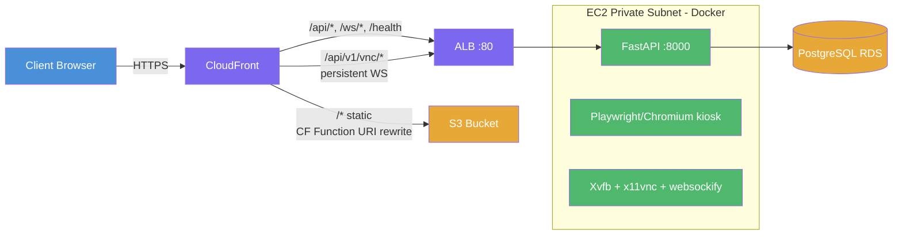
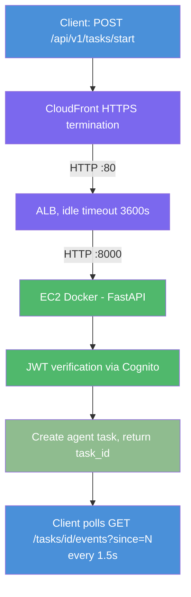
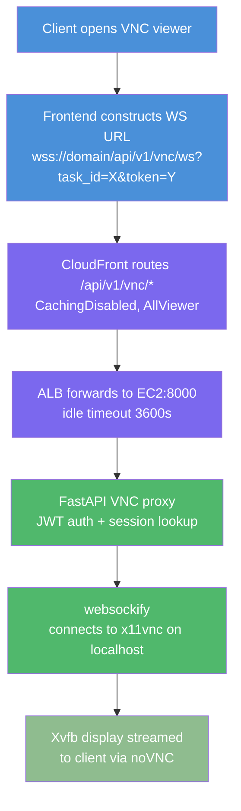
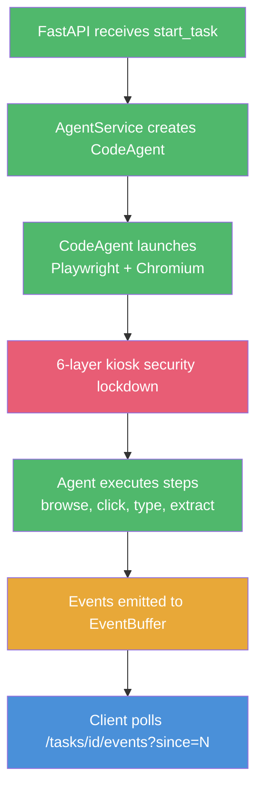
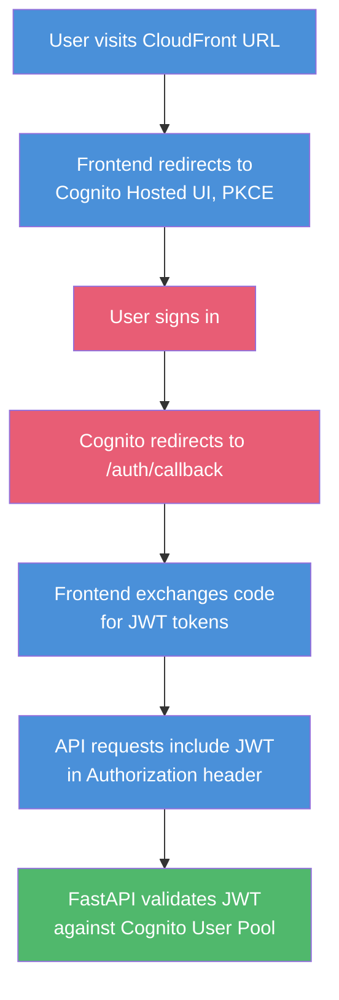

# Request Flow: CloudFront -> ALB -> EC2 Docker Container

## Architecture Overview

CloudFront is the single entry point for all traffic. API Gateway exists in Terraform but is **completely bypassed** -- CloudFront routes directly to the ALB to avoid the 30-second integration timeout that kills persistent WebSocket connections.

## Complete Request Flow



## CloudFront Cache Behaviors

| Priority | Path Pattern     | Origin | Caching  | Methods              | Purpose                       |
|----------|-----------------|--------|----------|----------------------|-------------------------------|
| 1        | `/api/v1/vnc/*` | ALB    | Disabled | All + WebSocket      | Persistent VNC WebSocket      |
| 2        | `/api/*`        | ALB    | Disabled | All                  | REST API + event polling      |
| 3        | `/ws/*`         | ALB    | Disabled | All                  | WebSocket connections         |
| 4        | `/health`       | ALB    | Disabled | GET/HEAD/OPTIONS     | Health check                  |
| default  | `/*`            | S3     | 1 hour   | GET/HEAD             | Static frontend (Next.js SPA) |

## API Request Flow (REST)



## VNC Browser Viewer Flow



## Browser Task Execution (Inside Docker)

When a task starts, the following runs inside the Docker container:



Kiosk security layers:
1. Openbox WM (no shortcuts, no decorations, forced maximize)
2. Chromium kiosk mode + enterprise policies
3. X11 key grabber daemon (intercepts Alt+F4, Ctrl+W, etc.)
4. x11vnc input filtering (-input KM, no clipboard)
5. Docker hardening (wget/gnupg removed post-build)
6. Enterprise policies JSON (/etc/chromium/policies/managed/)

## Data Persistence

| Data              | Storage                | Access                         |
|-------------------|------------------------|--------------------------------|
| Chat messages     | PostgreSQL RDS         | Backend via SQLAlchemy async   |
| Conversations     | PostgreSQL RDS         | Backend via SQLAlchemy async   |
| User state        | PostgreSQL RDS         | Backend via SQLAlchemy async   |
| LLM API keys      | SSM Parameter Store    | EC2 fetches at container start |
| Session data      | DynamoDB               | EC2 via IAM instance profile   |

## Authentication Flow



## Why API Gateway Is Bypassed

API Gateway (HTTP API) still exists in Terraform but receives **zero traffic**:

1. **30-second integration timeout**: API Gateway kills long-lived connections (VNC WebSocket, SSE) after 30 seconds. This is a hard limit that cannot be increased.
2. **CloudFront direct-to-ALB**: CloudFront routes all `/api/*` and `/ws/*` traffic directly to the ALB, which has a 3600-second idle timeout.
3. **JWT auth in FastAPI**: Authentication is handled by the backend, not API Gateway.
4. **Candidate for removal**: API Gateway can be removed from Terraform to simplify the architecture.

## EC2 Instance Details

- **Type**: t3.medium (4 GB RAM)
- **Memory**: 4 GB RAM + 2 GB swap = 6 GB addressable
- **Subnet**: Private (no public IP)
- **AMI**: Amazon Linux 2023 (x86_64)
- **Container**: Single Docker container (FastAPI + Playwright + VNC stack)
- **Deployment**: Hot-deploy via SSM RunShellScript (ECR pull + container restart)

## Network Security

| Component    | Inbound Rules                                     |
|-------------|---------------------------------------------------|
| ALB SG      | HTTP :80 from CloudFront prefix list + VPC CIDR   |
| Backend SG  | :8000 from VPC CIDR only                          |
| PostgreSQL  | :5432 from Backend SG only                        |

## Troubleshooting

### Health check fails
```bash
curl -s https://d3p903fxpmjf8v.cloudfront.net/health
# Expected: {"status":"healthy"}
```

### Check EC2 via SSM
```bash
aws ssm send-command --region ca-central-1 \
  --instance-ids i-052e44a607d603f36 \
  --document-name "AWS-RunShellScript" \
  --parameters commands='["docker ps -a","free -m","docker logs openbrowser-backend --tail 50"]'
```

### Common issues
- **504 Gateway Timeout**: EC2 OOM -- check `free -m` via SSM, verify swap exists
- **VNC disconnects**: ALB idle timeout may have been exceeded (3600s limit)
- **SSM command "Delayed"**: EC2 is unresponsive (OOM, disk full) -- reboot via `aws ec2 reboot-instances`
- **Docker ModuleNotFoundError after instance restart**: Stale overlay -- redeploy fresh container from ECR
